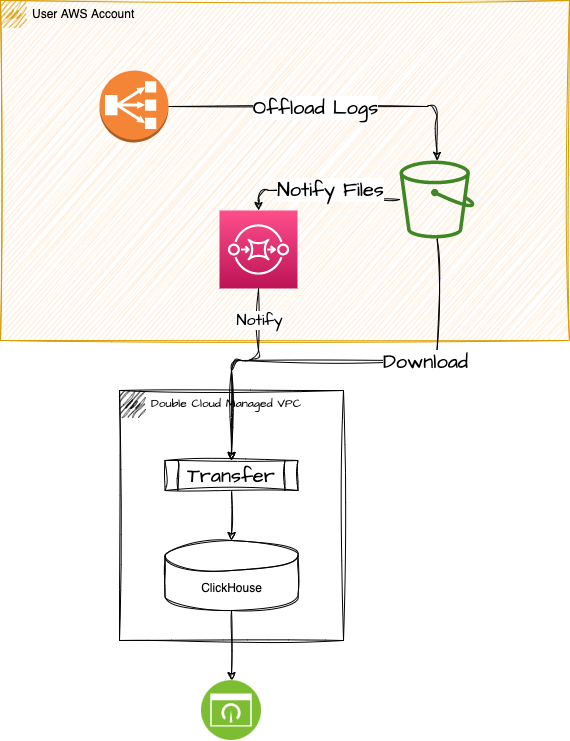

DoubleCloud Platform Terraform module examples
=====

Coll
ection of examples for using Terraform with DoubleCloud Platform.

Clone the repository:

```
git clone https://github.com/doublecloud/terraform-doublecloud-examples.git
cd terraform-doublecloud-examples
```

Change to the directory with the example:

```
cd EXAMPLE_NAME
```

Follow instructions in the README.md for the example.

__Table of Contents__

1. [hello-world](#hello-world)
1. [dc-clickhouse-kafka](#dc-clickhouse-kafka)
1. [dc_clickhouse_kafka_transfer](#dc_clickhouse_kafka_transfer)
1. [byoc_ch_peering](#byoc_ch_peering)
1. [aws-rds-to-clickhouse](#aws-rds-to-clickhouse)
1. [aws_doc_db_intergation](#aws_doc_db_intergation)
1. [aws-s3-lb-ingest](#aws-s3-lb-ingest)

## [Hello World!](https://github.com/doublecloud/terraform-doublecloud-examples/tree/main/hello-world)

Bare minimum example


**Figure 1.** *Hello World*

## [Clickhouse Plus Kafka](https://github.com/doublecloud/terraform-doublecloud-examples/tree/main/dc-clickhouse-kafka)

Simple Clickhouse plus Kafka


**Figure 2.** *Clickhouse Plus Kafka*

## [Clickhouse Kafka Transfer](https://github.com/doublecloud/terraform-doublecloud-examples/tree/main/dc_clickhouse_kafka_transfer)

Demo application of transfer between Kafka and Clickhouse utilizing DoubleCloudTransfer and KafkaEngine.


**Figure 3.** *Clickhouse Plus Kafka*

## [Clickhouse BYOA Peering](https://github.com/doublecloud/terraform-doublecloud-examples/tree/main/dc_clickhouse_kafka_transfer)

ClickHouse inside customer AWS Account


**Figure 4.** *Clickhouse BYOA Peering*

## [AWS RDS Integration](https://github.com/doublecloud/terraform-doublecloud-examples/tree/main/aws_rds_integration)

Transfer from AWS RDS to DoubleCloud Clickhouse from customer AWS Account


**Figure 4.** *AWS RDS Integration*

## [AWS DocDB Integration](https://github.com/doublecloud/terraform-doublecloud-examples/tree/main/aws_docdb_integration)

Transfer from AWS DocDB to DoubleCloud Clickhouse from customer AWS Account


**Figure 5.** *AWS DocDB Integration*

## [AWS LoadBalancer logs to Clickhouse](https://github.com/doublecloud/terraform-doublecloud-examples/tree/main/aws_docdb_integration)

End to end terraform example for setting up AWS NLB access logs observability stack inside Clickhouse



**Figure 6.** *AWS LoadBalancer logs to Clickhouse*


