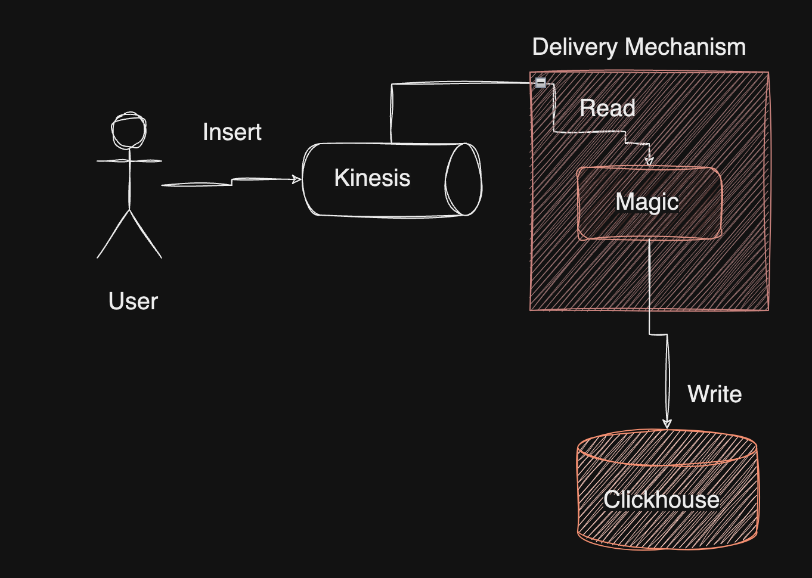
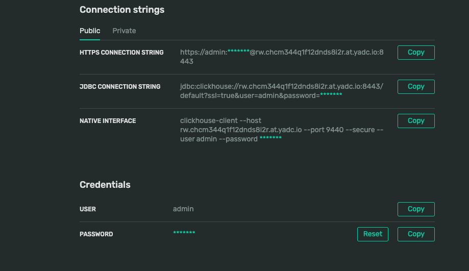
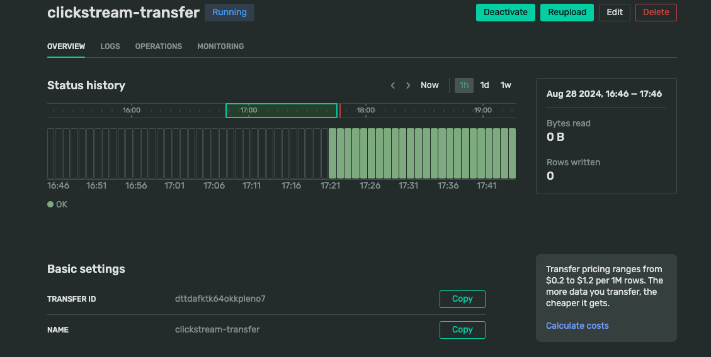
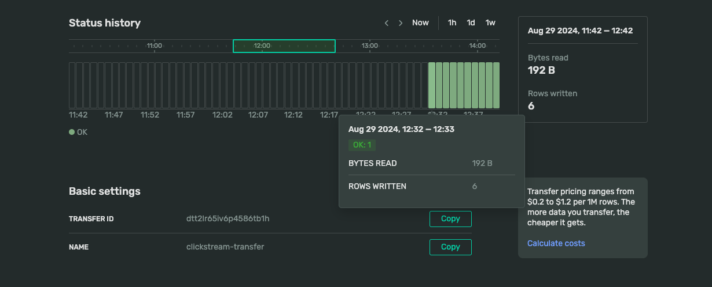

Here are the grammar edits for the provided Markdown:

## Clickstream App

Clickstream Demo app for real-time analytics powered by Double.Cloud.

This example creates a simple clickstream infrastructure:

1. Kinesis stream buffer
2. Clickhouse as click storage
3. Transfer as click delivery mechanism

**Baseline Architecture**




Clusters would be visible in UI:

**Clickhouse:**



Once we have clusters set up, we can start building a clickstream solution from it.

**Transfer:**



### Upload sample data

For testing purposes, you can use the AwsCli to insert data into the kinesis stream. This only requires having AwsCli installed. In addition to the previous step, AWS profile is required to be authenticated and has permissions to create Kinesis stream and insert in kinesis.
For production use cases, you should consider setting up networking access via [this](https://double.cloud/docs/en/vpc/connect-dc-to-aws) guide.

```shell
aws kinesis put-record \ 
--stream-name TERRAFORM_TEST_STREAM_1 \ 
--partition-key 1 \
--cli-binary-format raw-in-base64-out \
--data '{"user_id":"user5", "score":300}' \
--region eu-central-1
.....
{
    "ShardId": "shardId-000000000003",
    "SequenceNumber": "49655344900802692514217175455629362318208481605544714538"
}
```

## Clickhouse delivery via DoubleCloud.Transfer

At Double.Cloud, our robust EL(t) engine, Transfer, boasts a pivotal feature—Queue Engine -> ClickHouse delivery. In crafting this delivery mechanism, we proactively addressed the lingering challenges:

1. **Automated Offset Management:** We've implemented automatic unparsed tables, streamlining the handling of corrupt data and eliminating the need for manual intervention in offset management.
2. **Enhanced Visibility:** To overcome the limited visibility inherent in ClickHouse, we've developed dedicated dashboards and alerts that provide real-time insights into specific delivery metrics. This includes comprehensive monitoring of data lag, delivered rows, and delivered bytes.
3. **Dynamic Scalability:** Transfer deploys delivery jobs externally, within Kubernetes, EC2, or GCP instances, allowing for independent scaling separate from the ClickHouse cluster. This ensures optimal scalability to meet varying demands without compromising performance.

Also, Double.Cloud Transfer enables automatic schema creation/migration capabilities; therefore, no need to perform any extra steps on the ClickHouse side.

Let's create transfer via Terraform:

```shell
terraform apply \
  -var="stream_name=YOUR_STREAM_NAME" \
  -var="enable_transfer=true" \
  -var="project_id=YOUR_PROJECT_ID" \
  -var="aws_profile=YOUR_AWS_PROFILE" \
  -var="federation_id=YOUR_DOUBLECLOUD_FEDERATION_ID" \
  -var="aws_access_key_id=AWS_ACCESS_KEY_ID" \
  -var="aws_region_id=AWS_REGION_ID" \
  -var="endpoint=DOUBLECLOUD_REST_API_ENDPOINT" \
  -var="federation_endpoint=DOUBLECLOUD_gRPC_ENDPOINT" \
  -var="aws_secret_access_key=AWS_SECRET_ACCESS_KEY" 
```

This option will create a transfer, from `./transfer.tf`

Once Terraform is applied, you will see the following

```shell
Apply complete! Resources: 5 added, 0 changed, 0 destroyed.

Outputs:

clickhouse_connection = {
  "host" = "CLICKHOUSE_HOST"
  "https_port" = 8443
  "password" = "CLICKHOUSE_PASSWORD"
  "tcp_port_secure" = 9440
  "user" = "admin"
}
```

The main thing on transfer configuration - parser rule:

[transfer.tf#L10-L67](./transfer.tf#L10-L67)
```hcl
      parser {
        json {
          schema {
            fields {
              field {
                name     = "Topic"
                type     = "string"
                key      = true
                required = true
              }
              field {
                name     = "Partition"
                type     = "uint32"
                key      = true
                required = true
              }
              field {
                name     = "Offset"
                type     = "uint32"
                key      = true
                required = true
              }
              field {
                name     = "Timestamp"
                type     = "datetime"
                key      = false
                required = false
              }
              field {
                name     = "Headers"
                type     = "string"
                key      = false
                required = false
              }
              field {
                name     = "Value"
                type     = "string"
                key      = false
                required = false
              }
              field {
                name     = "Transfer_commit_time"
                type     = "uint64"
                key      = false
                required = false
              }
              field {
                name     = "Transfer_delete_time"
                type     = "uint64"
                key      = false
                required = false
              }
            }
          }
          null_keys_allowed = false
          add_rest_column   = true
        }
      }
```

After applying, it will create transfer:



This transfer automatically creates a table called: `${STREAM_NAME}_unparsed`, the name was inferred from the Kinesis stream name, and it delivers rows into it:

```sql
SELECT count(*)
FROM  ${STREAM_NAME}_unparsed LIMIT 100

┌─count()─┐
│    6    │
└─────────┘

1 row in set. Elapsed: 0.323 sec.
```

To see what happens inside, you can explore transfer logs and metrics:

**Logs**


**Metrics**


The approach with Transfer (i.e., a separate delivery mechanism) is much more reliable and scalable, and in some cases, even easier to set up, since all setup is in one place (Terraform).

**Terraform**
<!-- BEGIN_TF_DOCS -->
## Requirements

| Name | Version |
|------|---------|
| <a name="requirement_terraform"></a> [terraform](#requirement\_terraform) | 1.5.7 |
| <a name="requirement_doublecloud"></a> [doublecloud](#requirement\_doublecloud) | >= 0.1.6 |

## Providers

| Name | Version |
|------|---------|
| <a name="provider_aws"></a> [aws](#provider\_aws) | 5.64.0 |
| <a name="provider_doublecloud"></a> [doublecloud](#provider\_doublecloud) | 0.1.24 |

## Modules

No modules.

## Resources

| Name | Type |
|------|------|
| [aws_kinesis_stream.this](https://registry.terraform.io/providers/hashicorp/aws/latest/docs/resources/kinesis_stream) | resource |
| doublecloud_clickhouse_cluster.target | resource |
| doublecloud_network.main | resource |
| doublecloud_transfer.clickstream | resource |
| doublecloud_transfer_endpoint.source | resource |
| doublecloud_transfer_endpoint.target | resource |
| doublecloud_clickhouse.target | data source |

## Inputs

| Name | Description | Type | Default | Required |
|------|-------------|------|---------|:--------:|
| <a name="input_aws_access_key_id"></a> [aws\_access\_key\_id](#input\_aws\_access\_key\_id) | AWS Secret Key with kinesis reader permissions | `string` | `""` | no |
| <a name="input_aws_profile"></a> [aws\_profile](#input\_aws\_profile) | AWS Profile | `string` | `"default"` | no |
| <a name="input_aws_region_id"></a> [aws\_region\_id](#input\_aws\_region\_id) | ID of the AWS region in which to create resources | `string` | `"eu-central-1"` | no |
| <a name="input_aws_secret_access_key"></a> [aws\_secret\_access\_key](#input\_aws\_secret\_access\_key) | AWS Secret Access Key with kinesis reader permissions | `string` | `""` | no |
| <a name="input_enable_transfer"></a> [enable\_transfer](#input\_enable\_transfer) | Create delivery from kinesis to clickhouse via DoubleCloud.Transfer | `bool` | `false` | no |
| <a name="input_endpoint"></a> [endpoint](#input\_endpoint) | Doublecloud REST API endpoint | `string` | `""` | no |
| <a name="input_federation_endpoint"></a> [federation\_endpoint](#input\_federation\_endpoint) | Doublecloud gRPC API endpoint | `string` | `""` | no |
| <a name="input_federation_id"></a> [federation\_id](#input\_federation\_id) | Federation ID to auth | `string` | `""` | no |
| <a name="input_project_id"></a> [project\_id](#input\_project\_id) | ID of the DoubleCloud project in which to create resources | `string` | `""` | no |
| <a name="input_stream_name"></a> [stream\_name](#input\_stream\_name) | Your stream name | `string` | n/a | yes |

## Outputs

| Name | Description |
|------|-------------|
| <a name="output_clikchouse_connection"></a> [clikchouse\_connection](#output\_clikchouse\_connection) | Clickhouse Connection profile |
<!-- END_TF_DOCS -->
