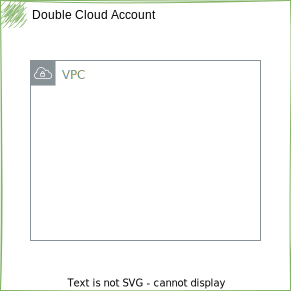

DoubleCloud Hello World
=====


This example show bare minimum setup of DoubleCloud terraform.

It creates a default network in defined cloud and region.




Example run configuration
```shell
terraform apply \
  -var="project_id=MY_PROJECT"
```

## Notes

- Ensure you review and modify variables, such as region-specific configurations or security settings, before applying the Terraform configurations.
- Double-check the IAM roles and permissions for AWS and DoubleCloud resources to ensure smooth connectivity and data transfer.
- For any issues or additional configurations needed, refer to the respective Terraform file and adjust accordingly.

---

Feel free to adjust the sections, descriptions, and images as needed to accurately represent your project structure and integration process!
