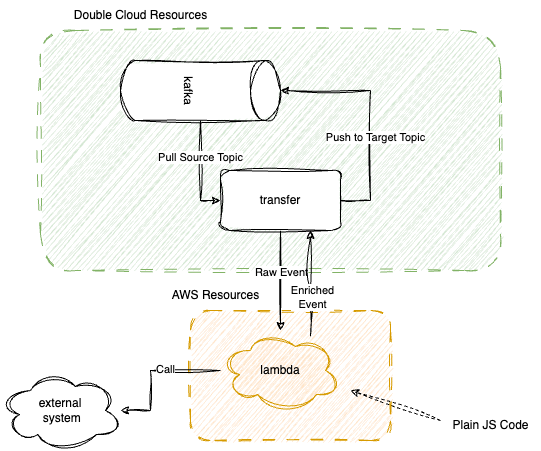

# Data enrichment with Kafka and AWS Lambda

This example for the DoubleCloud Terraform provider shows
how to enrich data in a Kafka topic using AWS Lambda functions.

## Project Structure

The project contains the following files:

1. `aws_infra.tf`: Manages the existing AWS infrastructure and
    contains one Lambda function that handles data transformation and enrichment.

2. `dc_infra.tf`: Manages the DoubleCloud infrastructure and creates a managed Apache Kafka cluster and a transfer.
    The Kafka cluster is created in a DoubleCloud-managed VPC.
    The transfer reads data from this cluster and writes it back after transformations are applied in AWS Lambda.

3. `encricher/main.js`: Implements the cloud transformation function in JavaScript.
    This function emulates a real-world use case — it parses, splits, and enriches data.

4. `producer/main.go`: A simple producer application that ingests semi-structured data into Kafka.
    This data needs advanced processing that the enriching cloud function takes care of.

## Architecture



Data is transferred from and to Kafka.
The transfer does the following:

1. Fetches data from a Kafka topic.

2. Sends the data to a Lambda function that splits, parses, and enriches it.

3. Writes the processed data to another Kafka topic.

The Lambda function is written in JavaScript. You can find the code in the `encircher` directory.

The transfer uses Kinesis-like message processing.

## Data transformation flow

When you enable data transformation with Lambda functions, DoubleCloud Transfer buffers the incoming data.
The buffering size is configurable with the buffering size hint of 1 MB.
The Lambda buffering interval hint ranges between 0 and 900 seconds.
The default Lambda buffering interval is 1 sec.

DoubleCloud Transfer invokes the cloud function asynchronously.
The transformed data is sent from the Lambda function to Transfer.
It parses the output and sends it to the destination.

> **IMPORTANT:**
> The Lambda synchronous invocation mode has a payload size limit of 6 MB for both the request and response.
> Make sure that your buffering size for sending the request to the function is less than or equal to 6 MB.
> Also ensure that the response that your function returns doesn’t exceed 6 MB.

### Data transformation and status model

All the transformed records from Lambda must contain the following parameters.
Otherwise, Amazon Data Firehose rejects them and treats it as a data transformation failure.

Each batch of messages is encoded as the following:

```json
{
  "Records": [
    {
      "cdc": {
        "commitTime":1718876759101000000, // Event time in Unix nanoseconds
        "kind":"insert",                  // Event type. Possible values are `insert`, `update`, or `delete`
        "schema":"",                      // Target schema name
        "table":"table_name",             // Target table name
        "columnnames":[],                 // List of columns. Should be in the same order as `columnvalues`
        "columnvalues":[],                // List of column values
        "table_schema":[                  // Result schema
          {
            "name":"ts",                  // Column name
            "type":"datetime",            // Column type
            "key":true,                   // Indicates if the column is the primary-key
            "required":true               // Inficates if the column is required
          }
        ]
      }
    }
  ]
}
```

The `cdc` field contains a DoubleCloud event.

Each record contains the following important fields:

* `commitTime`: Event time in Unix nanoseconds.
    It’s usually immutable because it specifies the time when the event took place.

* `kind`: Event type.
    Possible values are `insert`, `update`, or `delete`.
    For inserts and deletes, you also must provide `oldkeys`.

* `table`: Target table name.

* `schema`: Target `db`, `schema`, or `namespace` name.

* `columnnames`: List of column names from events.

* `columnvalues`: List of column values from events.

* `table_schema`: List of result table columns.


### Result Handling

The semantic of Lambda call invocation should be strict.
For each record sent to Lambda, we return exactly one result.

* `result`: Status of the record’s data transformation.
    Possible values are:

    * `Ok`: The record was transformed successfully
    * `Dropped`: The record was dropped intentionally by your processing logic
    * `ProcessingFailed`: The record couldn’t be transformed
    * `Split`:  The record multiplied

If a record has a status of `Ok`, `Dropped`, `Split`, DoubleCloud Transfer considers it successfully processed.
Otherwise, it’s processed unsuccessfully.

If the result is `Ok`, the function should return a result record with the `cdc` field.
If the result is `Split`, the function should return a result record with the `cdc_split` field —
a list of DoubleCloud `event` values.

## Step-by-step guide

1. If you haven’t already,
    [install Terraform](https://developer.hashicorp.com/terraform/install).

1. Clone this repository:

    ```shell
    git@github.com:doublecloud/terraform-doublecloud-examples.git
    ```

1. Get your AWS credentials (the `default` profile).

1. Get your DoubleCloud credentials. For details, refer to [DoubleCloud docs]( https://double.cloud/docs/en/public-api/tutorials/transfer-api-quickstart).

1. Create a `env.tfvars` with variables or provide the values as CLI arguments
   
1. Run `terraform init` and `terraform apply` to download the providers and provision the infrastructure.

Example `terraform apply` command with variables passed as arguments:

```shell
 terraform apply \
  -var="my_ip=$(curl -4 ifconfig.me)" \                                                                                          
  -var="my_ipv6=$(curl -6 ifconfig.me)" \
  -var="project_id=YOUR_DC_PROJECT_ID" \
  -var="federation_id=YOUR_FEDERATION_ID"
```

## Demo

An example of the `producer.kafka` file 
that uses the [VS Code kafka toolkit](https://marketplace.visualstudio.com/items?itemName=jeppeandersen.vscode-kafka):

```shell
PRODUCER non-keyed-json-message
topic: source-topic
ts={{time.recent}}&ip=FILL_ME&useragent={{internet.userAgent}}&data={"appid":"rand_id_{{random.number}}","payload":{"EMAIL":"{{internet.email}}","MOBILE":"{{phone.phoneNumberFormat}}"},"identity":"{{internet.exampleEmail}}"}
```

It produces a message with randomly generated content.
The enricher then parses it and enriches with the current Lambda public IPv4 address into the following:

```json
{"appid":"rand_id_27212","data":{"EMAIL":"Laisha28@yahoo.com","MOBILE":"366-380-1466"},"identity":"Lucas_Dickinson@example.com","ip":"44.201.33.239","ts":"1722183591238"}
```

To run the consumer, use the following command:

```shell
CONSUMER consumer-group-id
topic: target-topic
partitions: 0
from: latest
```

## Notes

* Before applying the Terraform configuration, make sure you reviewed and modified variables,
    such as region-specific configurations or security settings
* Double-check the IAM roles and permissions for AWS and DoubleCloud resources
    to ensure smooth connectivity and data transfer.
* For any issues or additional configurations needed, refer to the respective Terraform file and adjust accordingly.
* To debug the cloud function, use the logs from DoubleCloud Transfer and AWS Lambda.
* To ensure that data is processed correctly,
    use the **Test** button in the source endpoint or the transfer.
