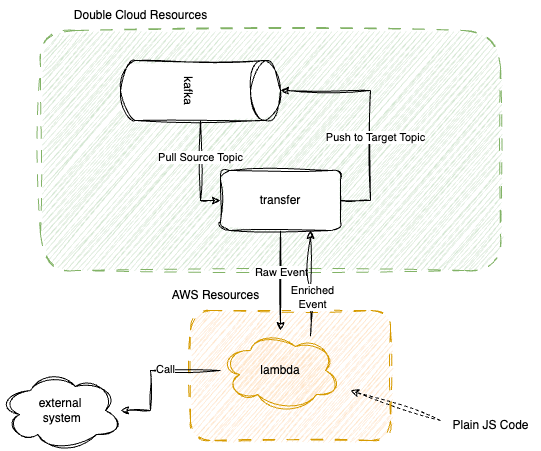

### Kafka Data Enrichment

In this example we will enrich data inside kafka topic with Lambda-function call.



There is a transfer between kafka <> kafka, this transfer fetch from one topic and write to another one.

Between them there is a lambda function that split, parse and enrich data in between.

Lambda function written in JS, see `encircher`-folder.

Transfer use kinesis-like message processing.

## Data Transformation Flow

When you enable cloud-function data transformation, DC.Transfer buffers incoming data. The buffering size is configurable, default buffering size hint is 1 MB. The Lambda buffering interval hint ranges between 0 and 900 seconds. The default Lambda buffering interval 1 sec. 
DC.Transfer then invokes the specified cloud function asynchronously. The transformed data is sent from Lambda to DC.Transfer. DC.Transfer parse output and then sends it to the destination.

### Important
The Lambda synchronous invocation mode has a payload size limit of 6 MB for both the request and the response. Make sure that your buffering size for sending the request to the function is less than or equal to 6 MB. Also ensure that the response that your function returns doesn't exceed 6 MB.

### Data Transformation and Status Model

All transformed records from Lambda must contain the following parameters, or Amazon Data Firehose rejects them and treats that as a data transformation failure.

Each batch of messages encoded as:

```json
{
  "Records": [
    {
      "cdc": {
        "commitTime":1718876759101000000, // Time of change, unix-nano seconds
        "kind":"insert",                  // Kind of change, can be insert / update / delete
        "schema":"",                      // Name of resulted schema
        "table":"table_name",             // Name of resulted table
        "columnnames":[],                 // List of columns, should be in same order as columnvalues
        "columnvalues":[],                // List of column values
        "table_schema":[                  // Resulted schema
          {
            "name":"ts",                  // name of column
            "type":"datetime",            // type of column
            "key":true,                   // is column primary-key
            "required":true               // is column required
          }
        ]
      }
    }
  ]
}
```

Inside `cdc` field there is DC-`event`.

For each record important fields:

**commitTime**:  Time of change, unix-nano seconds, it's a physical time of event, usually shall not be changed

**kind**:  Kind of change, can be `insert` / `update` / `delete`. For inserts and deletes you also must provide `oldkeys`

**table**: Name of target table

**schema**: Name of target `db` / `schema` / `namespace`

**columnnames**: List of column names that presented in change-items

**columnvalues**: List of column values that contains in resulted event.

**table_schema**: List of result table columns. 


### Result Handling

Semantic of lambda call invocation should be strict, on each record sended to lambda we shall return exactly on result. 


**result**:
The status of the data transformation of the record. 

The possible values are: 
- `Ok` - the record was transformed successfully
- `Dropped` - the record was dropped intentionally by your processing logic
- `ProcessingFailed` - the record could not be transformed 
- `Split` - the record multiplied

If a record has a status of Ok or Dropped or Split, DC.Transfer considers it successfully processed. 
Otherwise, it unsuccessfully processed.

If result is `Ok` - function should return in result record with `cdc` field.
If result is `Split` - function should return in result record with `cdc_splitted` field, which is a list of DC `event`-s.
