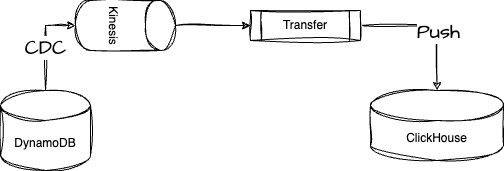

# Terraform Project: DynamoDB CDC Ingestion into Clickhouse

This Terraform project aims to ingest real-time data from DynamoDB into an existing DoubleCloud Clickhouse cluster.



Project cover e2e example project with cluster, transfer and dashboard.

## Project Structure

### 1. `main.tf`

This file bootstrap required providers and there versions.

### 2. `variables.tf`

Declare parametrisation supported by this example.

### 3. `dynamodb.tf`

Configure DynamoDB table with predifined attributes and insert couple rows in it.
This DynamoDB instance also connected to Kinesis Data Stream.

### 4. `transfer.tf`

Configures the data transfer from the [DynamoDB](https://todo.com) kinesis stream to the DoubleCloud ClickHouse cluster. This will involve setting up **replication** transfer worker. New data will be sync automatically with minimal lag possible.

Transfer specify parsing rules which forms resulting table. This resulting table will include all columns from original DynamoDB table and couple system columns.


## Getting Started

1. **Prerequisites:** Ensure you have Terraform installed.
2. **Clone the Repository:** Clone this repository to your local environment.
3. **Double Cloud Credentials:** Set up Double Cloud credentails, see [this]( https://double.cloud/docs/en/public-api/tutorials/transfer-api-quickstart) link for details.
4. **Prepare Variables:** Prepare variables in the `env.tfvars` files as needed, or path them from CLI-arguments.
5. **Terraform Apply:** Run `terraform init` followed by `terraform apply` to provision the infrastructure.

Example run configuration
```shell
terraform apply \
  -var="my_ip=$(curl -4 ifconfig.me)" \
  -var="my_ipv6=$(curl -6 ifconfig.me)" \
  -var="project_id=DC_PROJECT_ID" \ 
  -var="cluster_id=DC_CH_CLUSTER_ID" \ 
  -var="aws_access_key_id=AWS_ACCESS_KEY" \
  -var="aws_secret_access_key=AWS_SECRET_ACCESS_KEY"
```

## Result

Once example is deployed you will see a dasboard:


All raw data will be available via clickhouse instance, see below we SQL example:


Here is resulted dashboard:


## Notes

- Ensure you review and modify variables, such as region-specific configurations or security settings, before applying the Terraform configurations.
- Double-check the IAM roles and permissions for AWS and DoubleCloud resources to ensure smooth connectivity and data transfer.
- For any issues or additional configurations needed, refer to the respective Terraform file and adjust accordingly.

---

Feel free to adjust the sections, descriptions, and images as needed to accurately represent your project structure and integration process!
