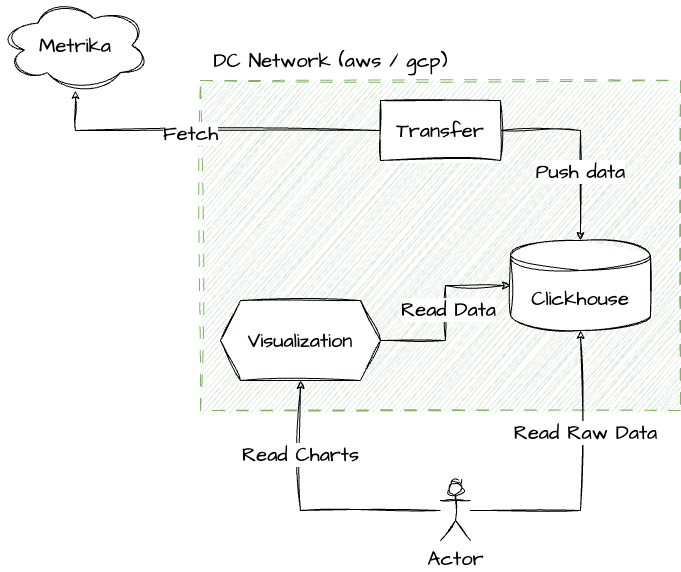
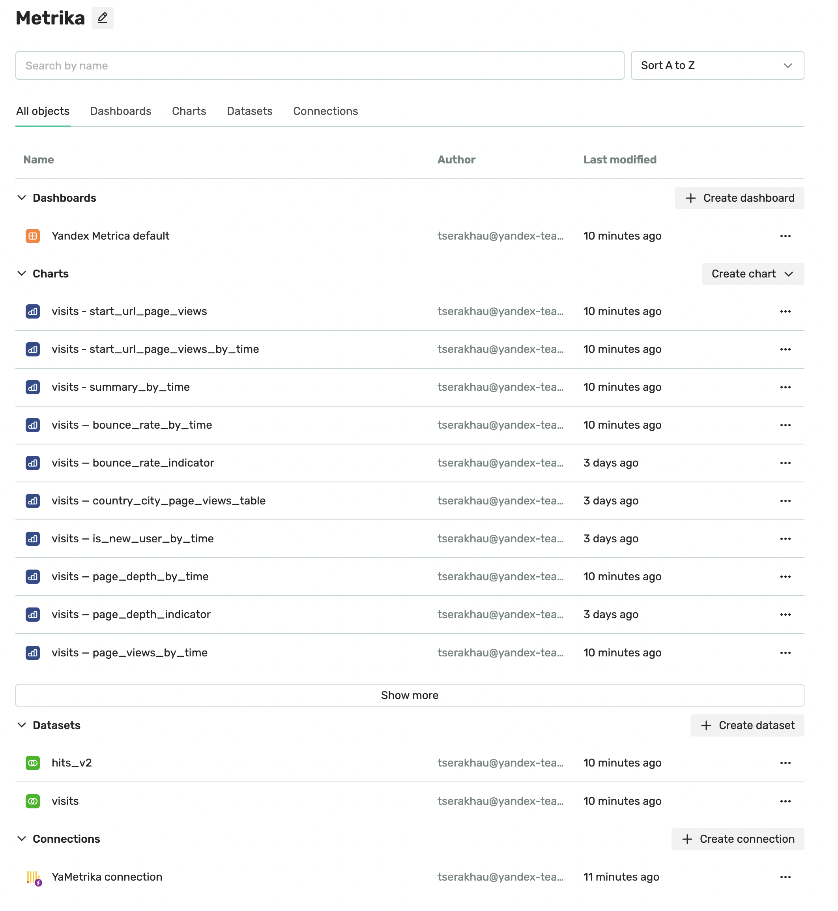
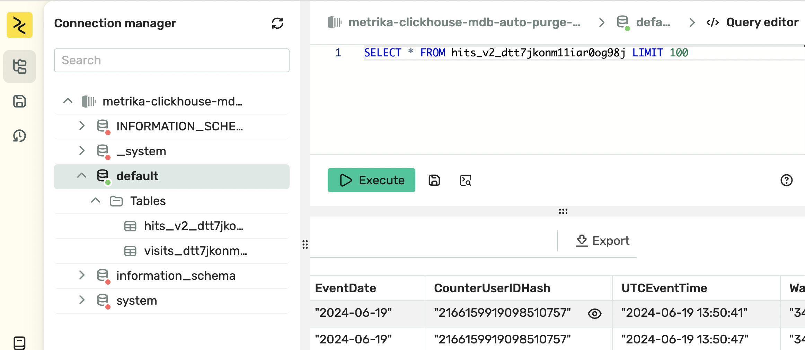
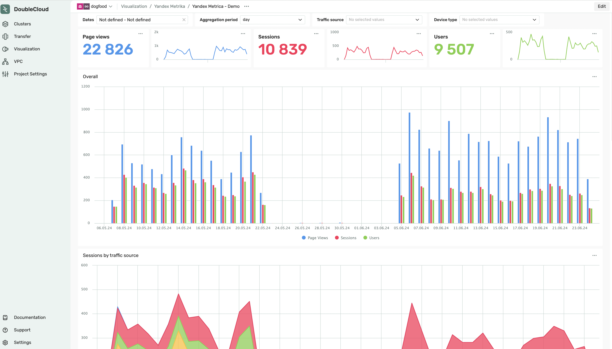

# Terraform Project: DoubleCloud clikchouse with Metrika connector

This Terraform project aims to integrate an existing DoubleCloud Clickhouse cluster with [Metrika](https://metrika.yandex.ru/list).



Project cover e2e example project with cluster, transfer and dashboard.

## Project Structure

### 1. `network.tf`

This file init DC-related infra, in particular DC-network.

### 2. `clickhouse.tf`

Establishes the connectivity between AWS and DoubleCloud by setting up the necessary Virtual Private Cloud (VPC) Peering to ensure communication between the environments.

### 3. `transfer.tf`

Configures the data transfer mechanism from the [Metrika](https://metrika.yandex.ru/list) tag instance to the DoubleCloud ClickHouse cluster. This will involve setting up **replication** transfer worker. New data will be sync automatically with minimal lag possible.

### 4. `visualization.tf`

Configure initial DC.Visualization, create workbook, with a connection. By default, disabled, can be enabled wiht `enable_visualization` variable.

### 5. `visualization_datasets.tf`

Create 2 datasets, for `hits` and `visits` table, those tables cames from transfer. By default, disabled, can be enabled wiht `enable_visualization_datasets` variable.

### 6. `visualization_charts.tf`

Create list of default charts with key metrics from Metrika tables. By default, disabled, can be enabled wiht `enable_visualization_charts` variable. 

### 7. `visualization_dashboard.tf`

Compose demo-dashboard from list of charts. By default, disabled, can be enabled wiht `enable_visualization_dashboard` variable.


## Getting Started

1. **Prerequisites:** Ensure you have Terraform installed.
2. **Clone the Repository:** Clone this repository to your local environment.
3. **Metria Credentials:** Get a metrika key, from [here](https://oauth.yandex.com/authorize?response_type=token&client_id=36b7fc9aa96c4fa09158bcacbbdc796a)
4. **Double Cloud Credentials:** Set up Double Cloud credentails, see [this]( https://double.cloud/docs/en/public-api/tutorials/transfer-api-quickstart) link for details.
4. **Prepare Variables:** Prepare variables in the `env.tfvars` files as needed, or path them from CLI-arguments.
5. **Terraform Apply:** Run `terraform init` followed by `terraform apply` to provision the infrastructure.

Example run configuration
```shell
terraform apply \
  -var="my_ip=$(curl -4 ifconfig.me)" \
  -var="my_ipv6=$(curl -6 ifconfig.me)" \
  -var="project_id=MY_PROJECT" \
  -var="federation_id=MY_AUTH_FEDERATION" \
  -var="metrika_counter_ids=[METRIKA_TAG_INSTANCE]" \
  -var="metrika_token=METRIKA_TOKEN" \
  -var="enable_transfer=true" \
  -var="enable_visualization=true" \
  -var="enable_visualization_datasets=true" \
  -var="enable_visualization_charts=true" \
  -var="enable_visualization_dashboards=true"
```

## Result

Once example is deployed you will see a dasboard:



All raw data will be available via clickhouse instance, see below we SQL example:



Here is resulted dashboard:



## Notes

- Ensure you review and modify variables, such as region-specific configurations or security settings, before applying the Terraform configurations.
- Double-check the IAM roles and permissions for AWS and DoubleCloud resources to ensure smooth connectivity and data transfer.
- For any issues or additional configurations needed, refer to the respective Terraform file and adjust accordingly.
- Metrika tag must be marked as `Metrika Pro` on metrika side, this can be done by contact metrika support

---

Feel free to adjust the sections, descriptions, and images as needed to accurately represent your project structure and integration process!
