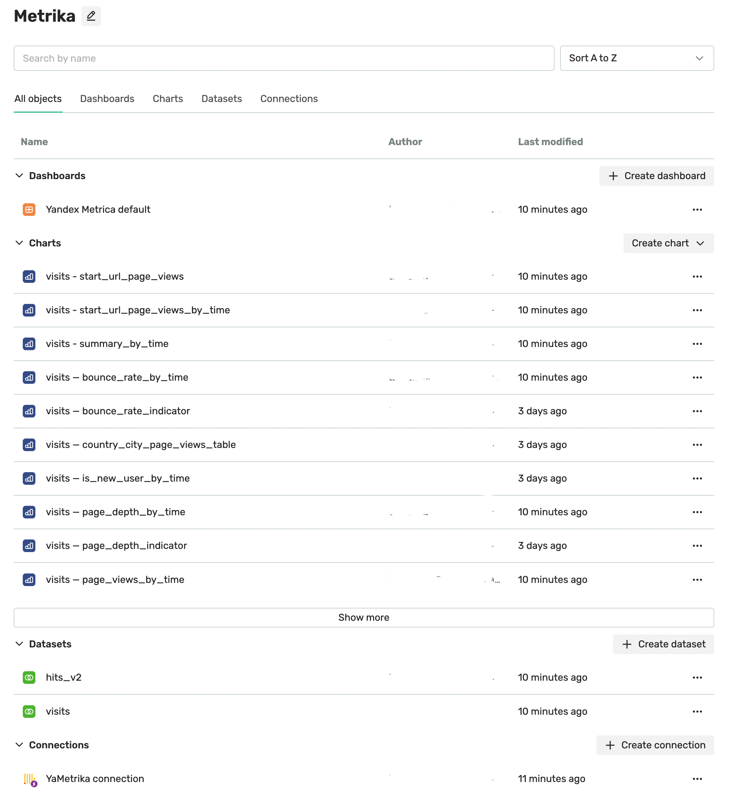

# Replicating data from Yandex Metrica to DoubleCloud ClickHouse

This example for the DoubleCloud Terraform provider shows
how to replicate and visualize data from [Yandex Metrica](https://metrika.yandex.ru/list) using DoubleCloud Transfer, Managed service for ClickHouse, and Visualization.
This end-to-end example project includes creating a ClickHouse cluster, data pipeline, and visualization dashboard.


This example project uses AWS, but DoubleCloud resources can also be deployed in Google Cloud.

## Project structure

The project contains the following files:

1. `network.tf`: Manages the DoubleCloud infrastructure, including the network.

2. `clickhouse.tf`: Establishes connectivity between AWS and DoubleCloud by configuring VPC peering.
    This enables communication between the environments.

3. `transfer.tf`: Configures a data transfer pipeline from [Metrica](https://metrika.yandex.ru/list) to the ClickHouse cluster on DoubleCloud.
    It involves deploying a transfer worker in the *replication* mode —
    it automatically syncs new data with a minimal possible lag.

4. `visualization.tf`: Configures DoubleCloud Visualization, creates a workbook, with a connection.
    Inactive by default.
    To enable it, use the `enable_visualization` variable.

5. `visualization_datasets.tf`: Creates two datasets for the `hits` and `visits` tables in the ClickHouse cluster.
    These tables contain the hits and sessions (visits) data from Metrica respectively.
    Inactive by default.
    To enable it, use the `enable_visualization_datasets` variable.

6. `visualization_charts.tf`: Creates a list of default charts with key metrics from Metrica tables. 
    Inactive by default. 
    To enable it, use the `enable_visualization_charts` variable. 

7. `visualization_dashboard.tf`: Creates a demo dashboard from a list of charts.
    Inactive by default.
    To enable it, use the `enable_visualization_dashboard` variable.


## Step-by-step guide

1. If you haven’t already,
    [install Terraform](https://developer.hashicorp.com/terraform/install).

1. Clone this repository:

    ```shell
    git clone git@github.com:doublecloud/terraform-doublecloud-examples.git
    ```

1. Get a Yandex Metrica access token in
    [Yandex OAuth](https://oauth.yandex.com/authorize?response_type=token&client_id=36b7fc9aa96c4fa09158bcacbbdc796a).

1. Make sure you have Metrica PRO or API access enabled in your Yandex Metrica account.
    If it’s not enabled or you’re unsure if it’s enabled,
    contact the {{ DC }} support and include your Metrica Tag ID in the message.
    We’ll contact the Metrica support team on your behalf and request them to enable API access for you.

1. [Create an API key](https://double.cloud/docs/en/administration/step-by-step/create-api-key) on DoubleCloud.

1. Add variables to the `env.tfvars` file.
    Alternatively, you can pass them as CLI arguments.

1. Run `terraform init` and `terraform apply` to download the providers and provision the infrastructure.

An example `terraform apply` command with variables passed as arguments looks as follows:

```shell
terraform apply \
  -var="my_ip=$(curl -4 ifconfig.me)" \
  -var="my_ipv6=$(curl -6 ifconfig.me)" \
  -var="project_id=MY_PROJECT" \
  -var="federation_id=MY_AUTH_FEDERATION" \
  -var="metrica_counter_ids=[METRICA_TAG_INSTANCE]" \
  -var="metrica_token=METRICA_TOKEN" \
  -var="enable_transfer=true" \
  -var="enable_visualization=true" \
  -var="enable_visualization_datasets=true" \
  -var="enable_visualization_charts=true" \
  -var="enable_visualization_dashboards=true"
```

## Result

Once the infrastructure has been deployed, the following assets will be available in a new in DoubleCloud Visualization:



The resulting dashboard with your Yandex Metrica data will look as follows:


All the raw data replicated from Metrica is available in the ClickHouse cluster,
and you can [access it in WebSQL](https://double.cloud/docs/en/managed-clickhouse/websql):


You can also [connect to the ClickHouse cluster with an IDE or CLI tool](https://double.cloud/docs/en/managed-clickhouse/step-by-step/cluster-db-connect).

## Notes

* Before applying the Terraform configuration, make sure you reviewed and modified variables,
    such as region-specific configurations or security settings.
* Double-check the IAM roles and permissions for AWS and DoubleCloud resources
    to ensure smooth connectivity and data transfer.
* If you encounter issues or want to modify the configuration,
    make changes in the corresponding Terraform files.

---

Feel free to adjust the sections, descriptions, and images as needed to accurately represent your project structure and integration process!
